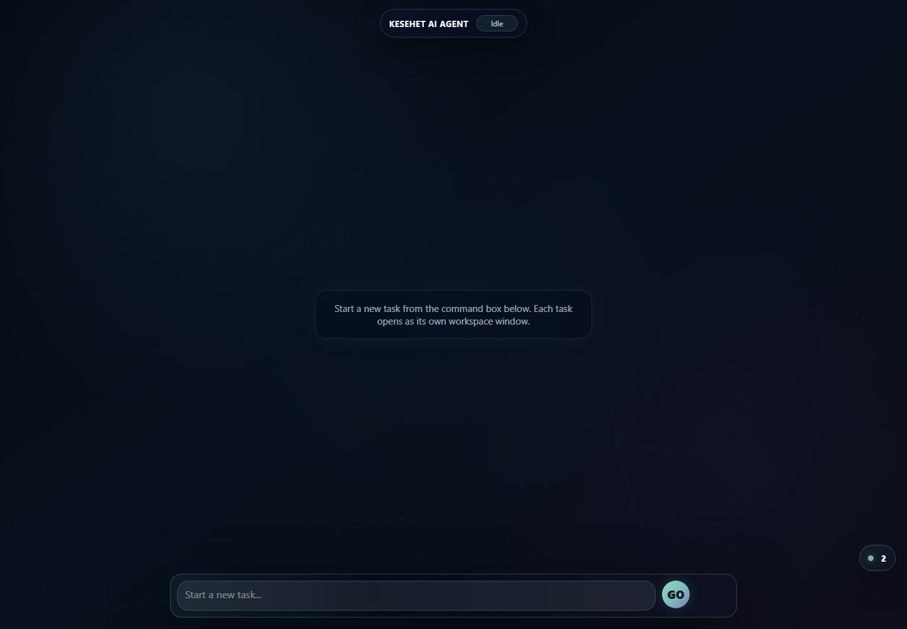
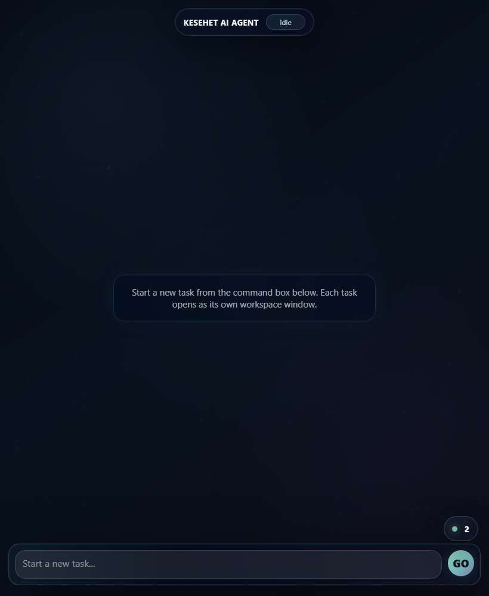

# Kesehet AI Agent

A local, Ollama-powered AI agent workbench with a browser UI, pluggable tools, durable memory, scheduled tool runs, file storage, web research, and CCTV/person-search experiments. It is part chatbot, part task runner, part little command center: give it a request, let it break the request into steps, watch each step run in its own workspace window, then get a final summary when the work is done.

This project is built for local-first experimentation. The model runs through Ollama, tools are Python packages discovered from `tools/*/manifest.json`, persistent state lives in SQLite under `internal/`, and the frontend is a lightweight Flask-served desktop-style interface.

## Screenshots

### Desktop Workbench



### Compact Workbench



## What It Does

- Plans a user request into action and validation tasks.
- Selects relevant tools for each prompt using the available tool manifests.
- Calls local Python tools through Ollama function calling.
- Stores durable memories in SQLite and injects relevant memories into future task context.
- Schedules tool calls for future or recurring execution.
- Keeps job history for scheduled runs.
- Reads and writes files inside the protected `internal/` workspace.
- Searches the web and extracts clean page content for the model.
- Tracks backend health and scheduler activity in the UI.
- Shows generated local images/videos from `internal/` directly in chat responses.
- Supports CCTV/property camera configuration and person detection workflows.
- Includes a tool-creation tool so the agent can scaffold or repair its own tool packages.

## The Experience

Open the app and you get a desktop-like canvas:

- A command box launches new tasks.
- Every task opens as a draggable workspace window.
- The app asks the model to plan the request before running it.
- Each plan item gets rendered as a step card.
- Action steps and validation steps are paired when possible.
- A final summary is added after the full plan finishes.
- Follow-up prompts can continue inside the same task window.
- A scheduler widget shows running, upcoming, and recent jobs.
- The animated node-field background pulses when the backend heartbeat is alive.

It is intentionally more theatrical than a plain chat box, because watching an agent work should not feel like staring into a log file in a basement.

## Quick Start

### 1. Install Python dependencies

Use Python 3.12 if possible, then install the requirements:

```powershell
python -m venv .venv
.\.venv\Scripts\Activate.ps1
pip install -r requirements.txt
```

The requirements include CUDA PyTorch wheels through the PyTorch CUDA 12.6 index. If your machine is CPU-only or uses a different CUDA setup, adjust `requirements.txt` before installing.

### 2. Install and run Ollama

Install Ollama, then pull the default model:

```powershell
ollama pull qwen3:8b
```

The app defaults to `qwen3:8b`, but you can override it with environment variables.

### 3. Configure environment variables

Create or update `.env` in the project root:

```env
OLLAMA_HOST=http://127.0.0.1:11434
OLLAMA_MODEL=qwen3:8b
OLLAMA_KEEP_ALIVE=-1m
OLLAMA_THINK=true
```

Optional:

```env
OLLAMA_API_KEY=your_token_if_your_host_requires_one
```

### 4. Start the app

```powershell
python app.py
```

Then open:

```text
http://localhost:5000
```

## GPU Helper Script

The repo includes a Bash helper for starting Ollama with NVIDIA GPU visibility:

```bash
./start_ollama_qwen3_gpu.sh
```

It:

- Finds the Ollama executable.
- Starts `ollama serve` if it is not already running.
- Pulls the configured model.
- Loads the model with `keep_alive`.
- Prints `ollama ps`.
- Prints `nvidia-smi` when available.

Environment knobs:

```bash
MODEL=qwen3:8b
OLLAMA_HOST=127.0.0.1:11434
CUDA_VISIBLE_DEVICES=0
OLLAMA_KEEP_ALIVE=-1m
OLLAMA_FLASH_ATTENTION=1
```

## Project Map

```text
.
|-- app.py                         Flask app and HTTP routes
|-- ai.py                          Ollama calls, planning, tool selection, memory context
|-- config.py                      Tiny JSON config helper
|-- config.json                    Agent personality/config text
|-- helper.py                      Flask request/response JSON helpers
|-- requirements.txt               Python dependencies
|-- start_ollama_qwen3_gpu.sh      Ollama GPU startup helper
|-- core/
|   |-- db.py                      SQLite schema, jobs, schedules, memories
|   `-- scheduler_runner.py        Background scheduler thread and tool execution
|-- templates/
|   `-- index.html                 Main UI shell
|-- static/
|   |-- css/index.css              UI styling
|   `-- js/index.js                Desktop windows, task flow, scheduler widget
|-- tools/
|   |-- main.py                    Tool discovery and lazy callable registry
|   |-- files/                     File tools for internal/
|   |-- find_person/               Camera config and person detection tools
|   |-- maths/                     Simple example math tools
|   |-- memory/                    Durable SQLite memory tools
|   |-- scheduler/                 Future/recurring tool scheduling
|   |-- tool_creator/              Tool scaffolding and repair
|   |-- tool_helper/               Tool introspection helpers
|   `-- web/                       Web search and extraction
`-- internal/                      Runtime data, SQLite DB, generated files
```

## HTTP Routes

| Route | Method | Purpose |
| --- | --- | --- |
| `/` | `GET` | Main browser UI. |
| `/heartbeat` | `GET` | Backend liveness check. |
| `/scheduler/status` | `GET` | Running, upcoming, and recent scheduler state. |
| `/internal_file/<path>` | `GET` | Serves files from `internal/` after path-safety checks. |
| `/plan` | `POST` | Converts a prompt into action/validation tasks and starter messages. |
| `/run_task` | `POST` | Runs one task through the model and selected tools. |
| `/summarize` | `POST` | Summarizes the completed task conversation. |

Example:

```powershell
Invoke-RestMethod http://localhost:5000/heartbeat
```

Plan a task:

```powershell
Invoke-RestMethod `
  -Method Post `
  -Uri http://localhost:5000/plan `
  -ContentType application/json `
  -Body '{"prompt":"Research Flask task queues and save notes"}'
```

## How The Agent Thinks, In Plain English

1. The browser sends your prompt to `/plan`.
2. `ai.py` asks Ollama to break the prompt into tasks.
3. The app creates task cards in the UI.
4. For each task, `/run_task` calls `ai_response`.
5. `select_tools_for_prompt` asks Ollama which tools are useful.
6. `ollama_call` sends the prompt, message history, and tool schemas to Ollama.
7. If Ollama calls a tool, Python executes the matching local function.
8. Tool results go back into the conversation.
9. The loop continues until the model returns a normal text response or the max tool rounds are reached.
10. `/summarize` produces a user-facing summary without exposing internal mechanics.

## Tool System

Tools are discovered automatically from subfolders inside `tools/`. A valid tool package needs:

- `main.py`
- `manifest.json`
- `__init__.py`
- at least one `test_*.py`

`tools/main.py` validates every package, reads its manifest, and adds a lazy callable to each tool definition. The callable imports the actual Python function only when the tool is executed.

### Minimal Tool Manifest

```json
{
  "name": "example",
  "module": "tools.example.main",
  "tools": [
    {
      "type": "function",
      "category": "custom",
      "function": {
        "name": "say_hello",
        "description": "Return a friendly greeting.",
        "parameters": {
          "type": "object",
          "properties": {
            "name": {
              "type": "string",
              "description": "Name to greet."
            }
          },
          "required": ["name"]
        }
      },
      "entrypoint": "say_hello"
    }
  ]
}
```

### Matching Implementation

```python
def say_hello(name: str) -> dict[str, str]:
    return {"message": f"Hello, {name}."}
```

Restart the Flask app after adding a new tool package, or call `refresh_tools()` from Python if you are working interactively.

## Built-In Tools

| Package | Category | Highlights |
| --- | --- | --- |
| `tools/files` | `files` | List, read, write, append, delete, move, copy, inspect, and search files under `internal/`. |
| `tools/memory` | `memory` | Remember, search, list, read, update, and delete durable memories in SQLite. |
| `tools/scheduler` | `calendar` | Save, list, update, and delete scheduled tool calls. |
| `tools/web` | `web` | Search the web and extract readable content. |
| `tools/find_person` | `surveillance` | Manage camera configs and run person-finding workflows over property footage. |
| `tools/maths` | `maths` | Example add/subtract tools. |
| `tools/tool_creator` | `tool_development` | Create, diagnose, and repair tool packages. |
| `tools/tool_helper` | `tools` | Inspect tool details. Hidden from normal selection summaries. |

## Durable Memory

Memory lives in the `memories` table in `internal/agent.sqlite3`.

The memory flow:

- The model can call `remember` to store useful facts.
- Future prompts are searched with `search_memory`.
- Matching memories are injected into the system context as "Relevant durable memories from SQLite".
- Memory records include `id`, `title`, `content`, `tags`, `created_at`, and `updated_at`.

Useful prompts:

```text
Remember that my preferred local model is qwen3:8b.
What do you remember about my local model preference?
List recent memories.
Delete the memory about the old server address.
```

## Scheduler

The scheduler stores future work in SQLite and runs in a background daemon thread. It starts lazily before the first Flask request.

Schedule records include:

- `tool_calls`
- `run_at`
- `repeat`
- `timezone_name`
- `enabled`
- `last_run_at`
- `next_run_at`

Job records include:

- `status`
- `tool_name`
- `tool_parameters`
- `result`
- `error`
- timestamps for queueing, start, and finish

Supported repeat examples:

```text
hourly
daily
weekly
every 15 minutes
every 2 hours
every day at 09:30
every week at 18:00
0 8 * * *
```

Example natural-language prompt:

```text
Every day at 08:00, search the web for local weather and save a short note.
```

The scheduler wakes every 5 seconds, claims due schedules, executes tool calls in order, records job results, and advances recurring schedules.

## Files And Generated Media

The file tools operate inside `internal/`, not the whole repository. This keeps agent-created notes, reports, images, videos, and scratch files in one runtime area.

When the assistant response mentions a local image or video path under `internal/`, the frontend turns it into a link and preview. Supported preview types include:

- `jpg`
- `jpeg`
- `png`
- `gif`
- `webp`
- `mp4`
- `webm`
- `mov`
- `avi`
- `mkv`

`/internal_file/<path>` performs a path containment check before serving anything.

## Configuration

`config.json` currently holds the agent personality:

```json
{
  "personality": "You are a helpful assistant that provides accurate and concise answers to user questions."
}
```

`ai.py` reads this value and uses it as part of the starter system message for planned tasks.

Environment variables:

| Variable | Default | Purpose |
| --- | --- | --- |
| `OLLAMA_HOST` | Ollama client default | Ollama server URL. |
| `OLLAMA_API_KEY` | unset | Optional bearer token for protected Ollama-compatible hosts. |
| `OLLAMA_MODEL` | `qwen3:8b` | Model used for planning, tool selection, and chat. |
| `OLLAMA_KEEP_ALIVE` | unset | Passed to Ollama requests when set. |
| `OLLAMA_THINK` | `true` | Enables/disables Ollama thinking mode. |

## Testing

Run the tool manifest tests:

```powershell
python -m pytest tools
```

If `pytest` is not installed:

```powershell
pip install pytest
python -m pytest tools
```

You can also smoke-test tool discovery directly:

```powershell
python -c "from tools.main import ALL_TOOLS; print(len(ALL_TOOLS)); print([t['function']['name'] for t in ALL_TOOLS])"
```

## Development Notes

- Keep generated/runtime data in `internal/`.
- Add new agent capabilities as tool packages, not as giant conditionals in `ai.py`.
- Keep manifest descriptions clear; the model uses them to choose tools.
- Keep tool parameters boring and JSON-shaped.
- Return dictionaries or lists from tools when practical.
- Add a `test_*.py` file to every tool package, because discovery enforces it.
- Restart the Flask app after changing tool manifests.

## Troubleshooting

### The app starts but model calls fail

Check Ollama:

```powershell
ollama ps
ollama pull qwen3:8b
```

Confirm `.env` points at the right host:

```env
OLLAMA_HOST=http://127.0.0.1:11434
```

### Tool discovery fails on startup

Every folder in `tools/` is treated as a tool package unless it starts with `__`. Make sure each package has:

```text
main.py
manifest.json
test_*.py
```

Also check that `manifest.json` contains valid JSON, a non-empty `name`, a non-empty `module`, and a `tools` list.

### Scheduled jobs never run

Open the app once so Flask starts the background scheduler, then check:

```text
http://localhost:5000/scheduler/status
```

Also verify that `next_run_at` is not empty and that the schedule is enabled.

### Web search is noisy or slow

The web tool searches, visits results, and extracts readable content. Reduce `max_results` for faster responses.

### CUDA install problems

This repo pins CUDA 12.6 PyTorch wheels. If your environment is not CUDA 12.6-compatible, replace the PyTorch lines in `requirements.txt` with the correct build for your machine.

## Security Notes

This is a local development workbench. Treat it accordingly.

- Tool calls execute local Python code.
- The file tools can write under `internal/`.
- The scheduler can run saved tool calls later.
- Camera credentials may be stored by the surveillance tools, though password fields are not returned by config reads.
- Do not expose this Flask server directly to the public internet without authentication, authorization, rate limits, and a serious review of every tool.

## A Good First Prompt

```text
Create a project note explaining what this agent can do, save it as notes/agent-overview.md, then verify the saved file.
```

That prompt exercises planning, file writing, file reading, validation, and summarization. A tiny parade through the whole system.

## License

This project uses a custom non-commercial private-use license. It is free for
private, personal, educational, and internal non-commercial use with visible
credit to the original GitHub repository:

```text
https://github.com/Kesehet/kesehet-ai-agent
```

Commercial use is not permitted without prior written permission from the
copyright holder. See [LICENSE](LICENSE) for the full terms.
